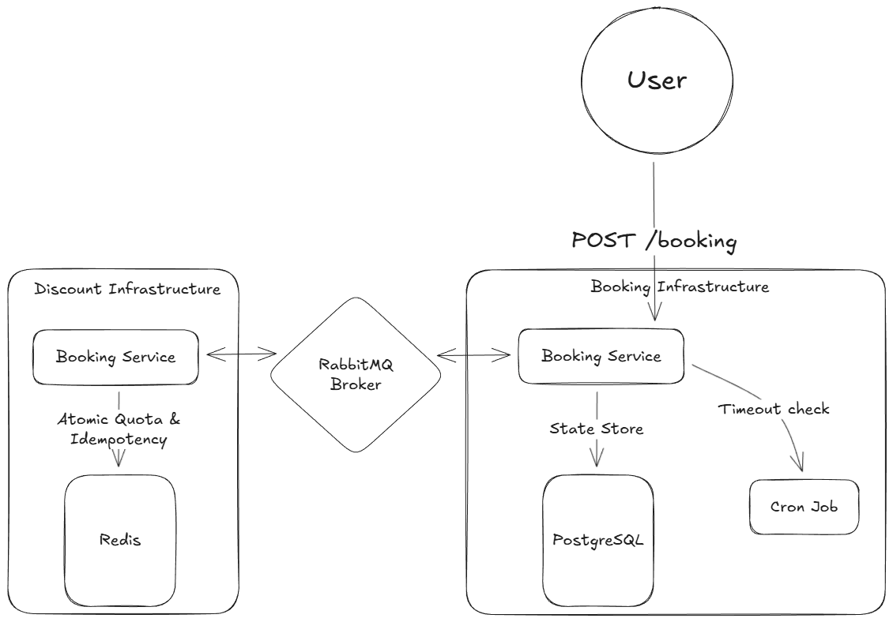
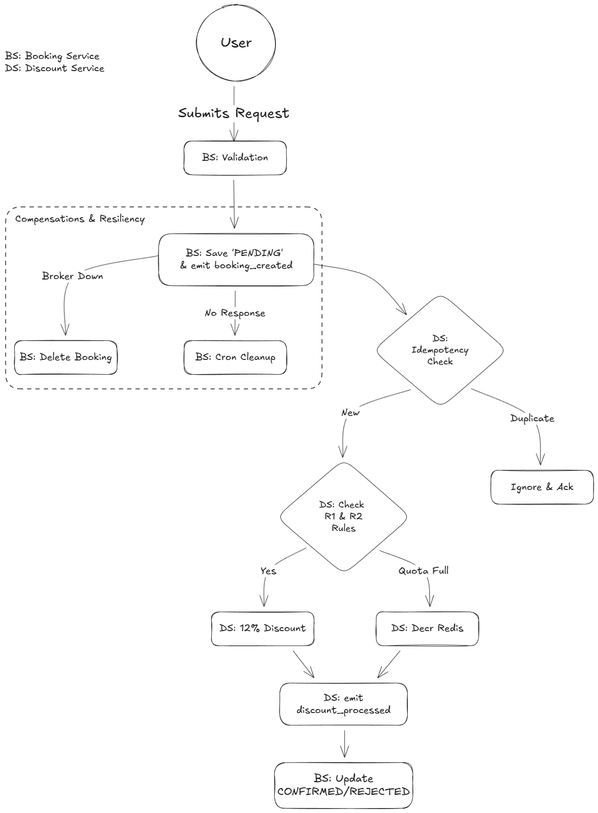

# Medical Booking System (Microservices)

This project implements a distributed booking system using NestJS microservices. It demonstrates the **Saga Pattern** for distributed transactions, ensuring eventual consistency between a **Booking Service** and a **Discount Service**.

## Architecture Overview

The system consists of two decoupled services communicating asynchronously via RabbitMQ:

1.  **Booking Service (Service A):**
    * Accepts HTTP requests to create bookings.
    * Persists initial state as `PENDING`.
    * Emits `booking_created` events to the message broker.
    * Listens for `discount_processed` events to finalize the booking status (`CONFIRMED` or `REJECTED`).

2.  **Discount Service (Service B):**
    * Listens for `booking_created` events.
    * Performs Idempotency Check: Uses Redis to verify this unique Booking ID hasn't been processed yet.
    * Evaluates business rules (R1: Eligibility) and system constraints (R2: Daily Quota).
    * Uses **Redis** for atomic quota management.
    * Emits the result back to the Booking Service.

3.  **Infrastructure:**
    * **RabbitMQ:** Message broker for asynchronous communication.
    * **Redis:** In-memory store for maintaining the daily discount quota.

## Diagrams

### System Architecture



### High-Level Flow



## Prerequisites

* Node.js (v22)
* Docker & Docker Compose
* pnpm

## Installation & Setup

1.  **Clone the repository**
    ```bash
    git clone https://github.com/shivam-taneja/medical-booking-system.git
    cd medical-booking-system
    ```

2.  **Install dependencies**
    ```bash
    pnpm install
    ```

3.  **Environment Configuration**
    Copy the `.env.example` to `.env` and fill in the values

4.  **Start Infrastructure**
    Start RabbitMQ and Redis containers:
    ```bash
    pnpm run du
    ```

5.  **Start Microservices**
    Run both services concurrently:
    ```bash
    pnpm dev
    ```

## Related Repository

**CLI Testing & Monitoring Tools:** [medical-booking-cli](https://github.com/shivam-taneja/medical-booking-cli.git)

The CLI repository provides comprehensive testing and monitoring capabilities including:
- Positive/banned/quota scenario testing
- Load testing with concurrent users
- Real-time Redis quota monitoring
- Database booking monitoring
- Edge case testing (race conditions, duplicates, rapid requests)

## Testing Scenarios

The following scenarios validate the business logic (Rules R1 & R2) and the compensation workflow.

| Scenario | Inputs | Expected Result |
| :--- | :--- | :--- |
| **Positive Case** | Female user, Today is birthday, Quota available | **Success:** 12% discount applied, status `CONFIRMED`. |
| **Negative Case A** | User ID: `fail_test_user` (or from env) | **Failure:** Business rule validation fails. Status `REJECTED` with reason "User is blacklisted". |
| **Negative Case B** | Valid User, Daily Quota Exhausted | **Failure:** System limit reached. Status `REJECTED` with reason "Daily discount quota reached". |                       |

## Technical Design Decisions

**1. Communication Pattern (Saga - Choreography)**
* The system uses an event-driven choreography approach.
* **Booking Service** emits events and does not block waiting for a response.
* **Discount Service** processes events asynchronously and emits a result event back.

**2. Persistence & State Management**
* **Booking Service:** Persists transaction states (`PENDING`, `CONFIRMED`, `REJECTED`) in PostgreSQL using TypeORM. It maintains a JSON-based audit trail (`history` column) for every state change.
* **Discount Service:** Uses Redis `INCR` commands to ensure atomic counting of daily discounts, preventing race conditions under high load.

**3. Idempotency & Concurrency (Critical)**
* **Redis Locking:** Implemented a `SET ... NX` lock (atomic check-and-set) in the Discount Service. This ensures that even if RabbitMQ delivers the same message twice (at-least-once delivery), the booking is processed **exactly once**.
* **Optimistic Locking:** The Booking Service checks that a booking is still in `PENDING` status before applying updates. This prevents race conditions if a user tries to cancel or modify a booking while a discount is being processed.

**4. Reliability & Compensation**
* **Automatic Compensation:** If the Discount Service crashes or fails to emit a result *after* incrementing the daily quota, a `catch` block triggers a **Compensating Transaction** (decrementing the Redis counter) to ensure the quota remains accurate.
* **Error Handling:** The system implements manual acknowledgment (`ack`) in RabbitMQ. Messages are only removed from the queue after they have been successfully processed and persisted.
* **Self-Healing Data:** Redis keys for daily quotas are set with a **TTL (Time-To-Live)** of 48 hours. This prevents memory leaks and ensures old data is automatically purged.

**5. Resilience (Cron Cleanup)**
* **Ghost Booking Resolution**: In a distributed system, a message might be lost or the Discount Service might crash before replying. I've implemented a Timeout Cron Job that runs every minute to identify bookings stuck in PENDING for over 5 minutes and automatically marks them as REJECTED.

## Troubleshooting

### Resetting Daily Quota

*Note: The system automatically expires quota keys after 48 hours. The following steps are for manual testing/resetting only.*

The system enforces a daily discount limit based on **IST (Indian Standard Time)**. The Redis key follows the format `discount_quota:YYYY-MM-DD`.

1. **Check Current Usage:**
   
   Verify how many discounts have been granted for today (e.g., `2026-01-30`).
   
   ```bash
   # Replace <container-id> with your Redis container ID
   docker exec -it <container-id> redis-cli get discount_quota:2026-01-30
   ```

2. **Reset Quota:**
   
   Delete only today's counter to allow new R1 discounts immediately.
   
   ```bash
   # Replace <container-id> with your Redis container ID
   docker exec -it <container-id> redis-cli del discount_quota:2026-01-30
   ```
